# 脚本处理管线流程图

> 红色节点 = LLM Token 消耗点，橙色节点 = TTS API 消耗点

```mermaid
flowchart TD
    subgraph INPUT["📂 输入阶段（无 Token 消耗）"]
        A[用户上传小说文本文件<br>/api/upload] --> B[章节分割<br>chapter_splitter.py]
        B -->|确定性正则规则<br>零 Token| C[chapters/manifest.json<br>+ 各章节 .txt]
    end

    subgraph GENERATE["🤖 脚本生成 generate_script_chapters.py"]
        C --> D{选择模式}
        D -->|mode=characters| E[仅分析人物池]
        D -->|mode=script| F[完整脚本生成]

        F --> G{reuse_character_book?}
        G -->|否| H["🔥 步骤1: 角色分析<br>character_analysis_prompt()"]
        G -->|是| I[跳过，复用已有人物池]

        H -->|"invoke_json() 最多重试3次"| H1["💰 LLM 调用 #1<br>input: 稳定前缀指令 + 已有character_book<br>+ 章节正文<br>output: 更新后的 character_book JSON"]
        H1 --> J[merge_character_books<br>合并+压缩角色表]
        J --> K[保存 character_book.json]

        I --> L
        K --> L["🔥 步骤2: 标注脚本生成<br>annotation_prompt()"]
        L -->|"invoke_tagged_entries() 最多重试3次"| L1["💰 LLM 调用 #2<br>input: 稳定前缀指令 + character_book<br>+ 前文连续性上下文 + 章节正文<br>output: tagged 文本脚本<br>（每行 <说话人:>文本 {instruct=...}）"]

        L1 --> M[parse_tagged_script_text<br>解析 tagged 文本为结构化条目]
        M --> N[normalize_script_entries<br>说话人别名归一化]
        N --> O[validate_chapter_script<br>原文覆盖率检查]

        O --> P{enable_chapter_memory?}
        P -->|是| Q["🔥 步骤3: 章节记忆生成<br>chapter_memory_prompt()"]
        P -->|否| R[跳过记忆生成]

        Q -->|"invoke_json() 最多重试3次"| Q1["💰 LLM 调用 #3<br>input: 稳定前缀指令 + character_book<br>+ 前文上下文 + 章节正文 + 脚本条目<br>output: chapter_memory JSON<br>（summary, ending_state, open_threads...）"]
        Q1 --> S[保存 chapter_memory.json]

        R --> T
        S --> T[checkpoint_script_outputs<br>保存 annotated_script.json + chunks.json]
        T --> U[sync_voice_config<br>更新 voice_config.json]

        E --> H
    end

    subgraph LOOP["🔄 章节循环"]
        U --> V{还有下一章?}
        V -->|是| G
        V -->|否| W[生成完成]
    end

    subgraph REVIEW["📝 脚本审校 review_script.py"]
        W -.->|用户手动触发| X[加载 annotated_script.json]
        X --> Y[按章节+batch_size 分批]
        Y --> Z["🔥 逐批审校"]
        Z -->|"invoke_review_text() 最多重试3次"| Z1["💰 LLM 调用 #4<br>input: review_system_prompt<br>+ 批次条目 JSON + 原文上下文<br>output: 修正后的条目 JSON 数组"]
        Z1 --> AA[check_text_loss<br>文本损失检测]
        AA --> AB{还有下一批?}
        AB -->|是| Z
        AB -->|否| AC[merge_consecutive_narrators<br>合并连续旁白]
        AC --> AD[保存修正后脚本 + 重建 chunks]
    end

    subgraph TTS["🔊 TTS 语音合成（非 LLM Token）"]
        AD -.->|用户手动触发| AE[逐 chunk 生成音频]
        AE --> AF["💰 TTS API 调用<br>（F5-TTS / Edge TTS / DashScope 等）<br>按音频时长或字符数计费"]
        AF --> AG[combine_audio_with_pauses<br>合并音频 + 插入停顿]
        AG --> AH[导出有声书<br>MP3 / M4B / Audacity]
    end

    style H1 fill:#ff6b6b,color:#fff,stroke:#c0392b
    style L1 fill:#ff6b6b,color:#fff,stroke:#c0392b
    style Q1 fill:#ff6b6b,color:#fff,stroke:#c0392b
    style Z1 fill:#ff6b6b,color:#fff,stroke:#c0392b
    style AF fill:#f39c12,color:#fff,stroke:#e67e22
```

## Token 消耗汇总

| 阶段 | 调用点 | 每章调用次数 | Token 构成 | 备注 |
|------|--------|-------------|-----------|------|
| **角色分析** | `invoke_json()` | 1次（最多重试3次） | Input: ~3K稳定指令 + character_book + 章节全文 Output: 完整 character_book JSON | 启用 prompt cache，稳定前缀跨章复用 |
| **标注脚本** | `invoke_tagged_entries()` | 1次（最多重试3次） | Input: ~2K稳定指令 + character_book + 上下文 + 章节全文 Output: tagged 文本（与原文等长甚至更长） | **Token 消耗最大的步骤**，output 通常是 input 的 0.8~1.2 倍 |
| **章节记忆** | `invoke_json()` | 1次（可选，最多重试3次） | Input: ~2.5K稳定指令 + character_book + 上下文 + 章节全文 + 脚本条目 Output: 轻量 JSON | 章节全文和脚本条目双重输入，但 output 较短 |
| **脚本审校** | `invoke_review_text()` | N批（每批25条，最多重试3次） | Input: review prompt + 批次条目 JSON + 原文上下文 Output: 修正后 JSON 数组 | 全书一次性操作 |
| **TTS 合成** | TTS API | 每 chunk 1次 | 按字符数/音频时长计费 | 非 LLM Token，是语音合成费用 |

## 关键优化设计

1. **Prompt Cache** — 三个 LLM 步骤都使用了 `CACHE_PROMPT_MARKER` 稳定前缀，OpenAI 端配合 `prompt_cache_key` + 24h retention，跨章复用缓存前缀减少重复 input token 计费
2. **Profile 压缩** — `compact_profile_text()` 限制 traits≤320字、voice_profile≤120字、key_terms≤120条，防止 character_book 随章节增长无限膨胀
3. **Context 窗口控制** — `recent_context_for_chapter()` 只取前3章记忆 + 最近6条脚本条目，不会把全书历史都塞进 prompt
4. **记忆可选** — `enable_chapter_memory` 默认关闭，开启后每章多一次 LLM 调用
